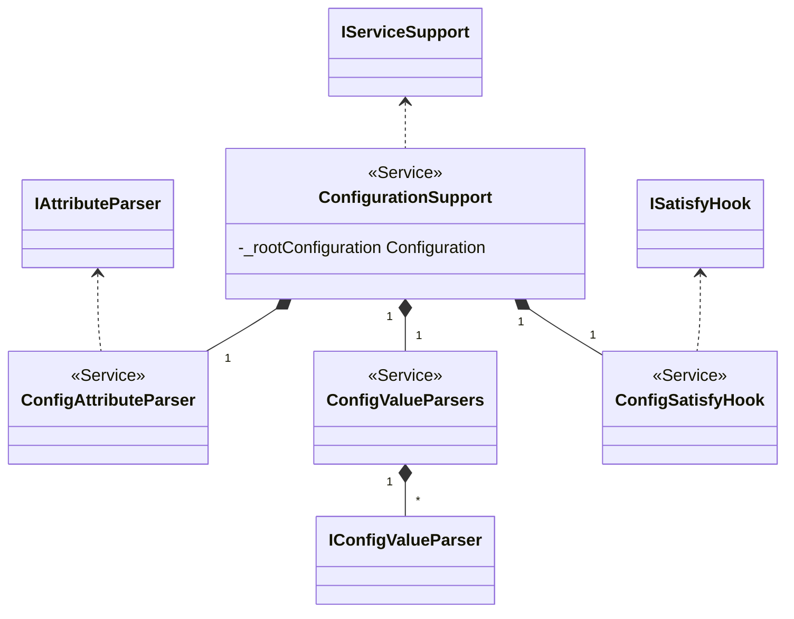

Attribute Parser
===

## Introduction
This feature is introduced from [[Inject Attribute to Prototype Service]]

To inject attribute to a Prototype Service, the Service Framework introduce an annotation `InitAttribute`, the annotation support reference value, Configuration Framework will support `config` prefix reference value like `config:config path`, the attribute parser will try find a configuration from specified config path.

## Implementation
![[Inject Attribute to Prototype Service#Attribute Parser APIs]]

