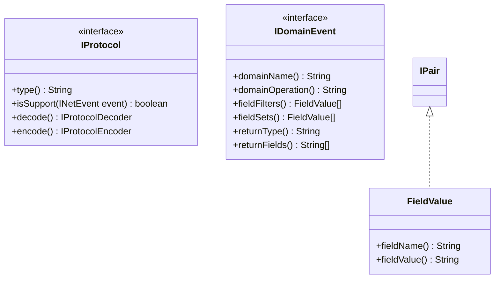

Protocol Parser Framework
======

# Class

```mermaid
classDiagram

class IProtocol {
	<<interface>>
	+type() String
	+isSupport(INetEvent event) boolean
	+decode() IProtocolDecoder
	+encode() IProtocolEncoder
}

class IDomainEvent {
	<<interface>>
	+domainName() String
	+domainOperation() String
	+fieldFilters() FieldValue[]
	+fieldSets() FieldValue[]
	+returnType() String
	+returnFields() String[]
}

class FieldValue {
	+fieldName() String
	+fieldValue() String
}
IPair <|.. FieldValue
```