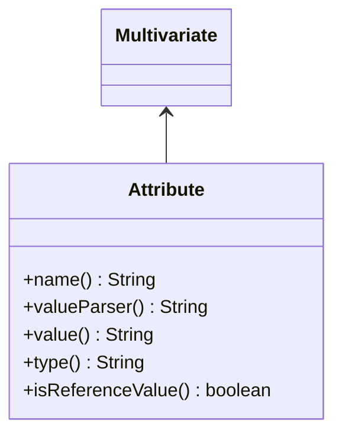
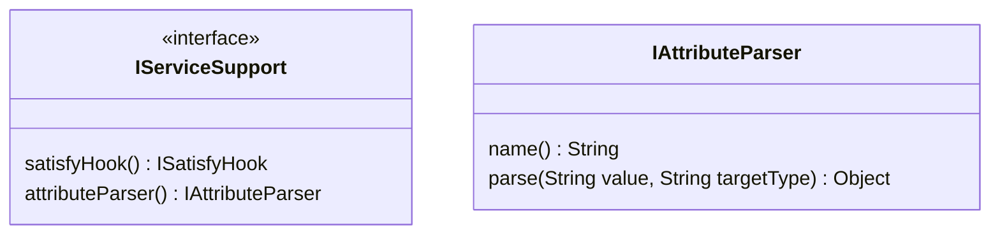

Support Inject Attribute in Prototype Service
===
## Introduction
The feature introduced from [[F2.7 Thread Pool Based Behavior Execution HD#Inject Attribute to Protocol Service]]

The service framework supports Prototype Service, the required attributes can be pass through when caller invoke `IRegistry::getService` API, but the framework does not support specified attribute value when the Prototype Service is injected by annotation `@Inject`.

When a Host Service depends a Prototype Service, currently the when registering the Host Service, the `Registry` will check all dependent services, if a dependent service is a Prototype Service, it will try to create an instance of the Prototype Service with some default attributes, so if the Prototype Service has non-default requited attribute, the instance of Prototype Service will failed to create.

The idea is we have to retrieve all required attributes before the creation of the instance of the Prototype Service.

## Implementation

### Annotation Handling Changes

Add new annotation named `@InitAttribute`:

```java
@Service
public class PrototypeService {

	@Attribute("attribute")
	protected int _attribute;
	
	...
}

@Service
public class HostService {
	
	@Inject
	@InitAttribute(name="attribute" value="config:HostService.attribute")
	protected PrototypeService _prototypeService;
}
```

The framework generate `getDependencies()` method based on `@Inject` annotation, to support `@InitAttribute` annotation, we need add new properties in the `Dependency`:

```java
public class Dependency {

	...
	private Map<String /* attribute name */, Attribute> _attributes;
	
	...
	public void addAttribute(Attribute attribute) {
		...
	}
}
```

#### Class for Attribute holding



### Parse and Inject Attributes

In `Registry:initInstanceAttributes(ServiceHolder hostSvc)` method, we need retrieve the attribute name and value from `Dependency` from the `hostSvc`.

The attribute value supports literal value and reference value, the reference value is constructed by `parser name:reference value`, the parser name identify which parser can parse the reference value.

To support attribute value parser, currently the `ISatisfyHook` needs support attribute value parser, so its name should changed.

#### Attribute Parser APIs



Service framework will check all registered `IServiceSupport`, if its attribute parser supports parse the value, the value will be pass through to the `IAttributeParser::parse` method to parse the value.

There are many `IServiceSupport` instance was registered in the Registry, so it is possible that more than 

In default the `attributeParser` will return null which mean the `IServiceSupport` instance does not support parse attribute.

The parser named `config` will be provided by `Configuration Framework`, check [[Attribute Parser]] for the details.