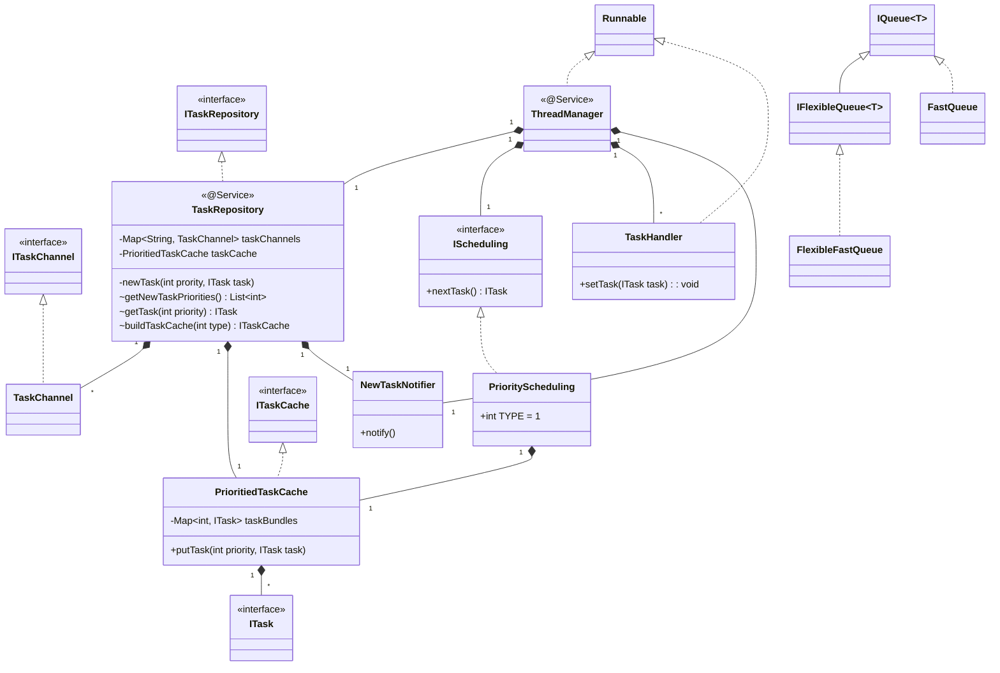
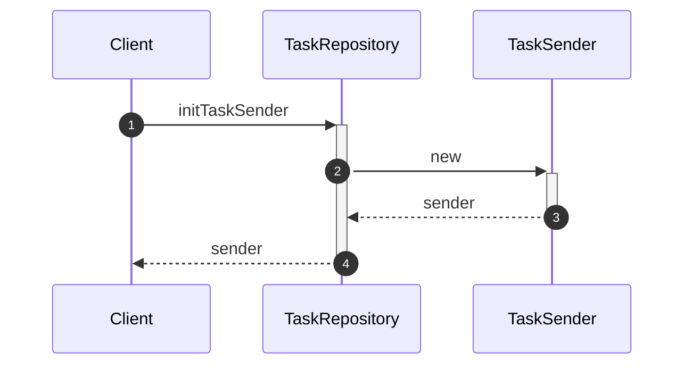
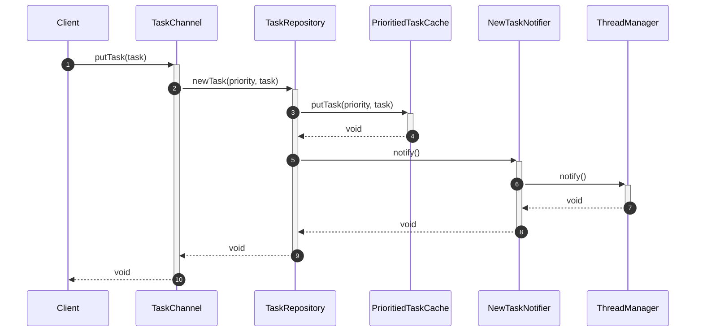
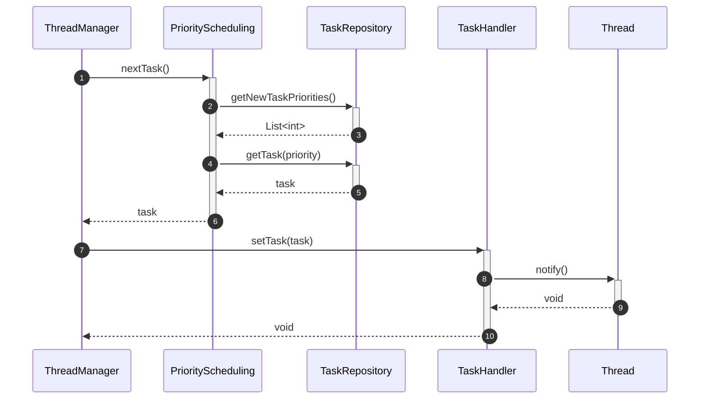

Unified Thread Management
======

# Introduction
The main target for Thread Pool is provide threads to execute `Task` by priority, there is a manager thread has responsibility to scan all `Task` in the `Task` repository.

| Feature | Status |
| ------ | ------ |
| [[Thread Pool Based Behavior Execution#Basic Thread Management]] | Processing |

# Feature List
## Manager Thread
1. A manager thread is always running and is able to manager all thread in the pool.
2. A manager thread is able to get notification if new task is added.

## Scheduling Algorithm
1. An interface for Schduling Algorithm.
2. Default scheduling is priority based.

# Implementation

## Class Diagram
Refer [[Thread Pool Based Behavior Execution#UTM APIs]] to see the APIs:

## Key Workflows
### Register

### Add New Incoming Task

### Execute Task by Priority

## Priority based Scheduling Algorithm
### Pure priority based scheduling
* Same priority task will put in same FIFO queue.
* Scheduling get task first from higher prority queue until the queue goes to empty then get task from lower prority queue.

==BAD: It is not fair, lower priority task will be not executed if higher priority task always exists in the queue==

### Scan time based scheduling
* Same priority task will be put in same FIFO queue.
* All task queue has a value to record its real priority.
* Scheduling will scan All task queue to find out the queue which has most highest real priority and then take task from it.
* The real priorty is dynamic, its calculation is:
	* The real priority value will be decrease (-1) when the scheduling take a task from the queue.
	* The real priority value will be increase (priority * coeficient) when the scheduling does not take any task from the queue.

==BAD: Scan all task queue and increase/decrease the real priority will consume a lot of time.==

### Execution time based scheduling
* Same priority task will be put in same FIFO queue.
* Each task queue has a value to trace the execution time for the task queue.