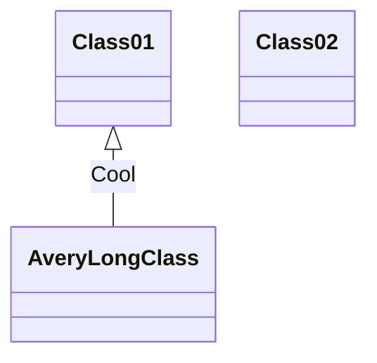

Application Workflow
======

# Information
| Name | Value |
| ------ | ------ |
| Case No |  2 |

# Define Domain

First, the application should define Domain that application supported, see [[Domain Definition]] for the details.

# DIL (Domain Interaction Language)

The UAPI based client using DIL to communicate with UAPI server, the DIL is Domain based language, it used to query/moidfy/delete operations on the Domain, the DIL schema is simple, see below:
```
<Domain Operation>(<Operation Arguments>): <Operation Return>
```
It just like invoke specific operation on a Domain, the operation returns should like the `Operation Return` notion.
See [[UAPI Interaction Language]] for the details.

# Communication Layer

Application server receive above request, the `ICommunicationEvent` will be thrown, then the event should be handled by `Communicator`, the `Communicator` will do below things:
* Decode out DIL from `ICommunicationEvent`. -> Using Protocol module
* Get out the root elemet of the DIL and find out the which Domain Operation is invoked, verify the operation is valid for the Domain, and the invocation has valid operation arguments.
* Create new `DomainEvent` with topic named `<Domain>.<Operation>` and throw the event to the Busniess Logic Layer.
* Receive `DomainResult` event, encode it to DIL and back to client side.

# Busniess Logic Layer

The `DomainEvent` will invoke corresponding Domain Operation which normally generated at compling time based on Domain object.
The real Domain Operation is a Behavior.
After Domain operation done the logic execution, the result will be wrapped to `DomainResult` object then throw out.

