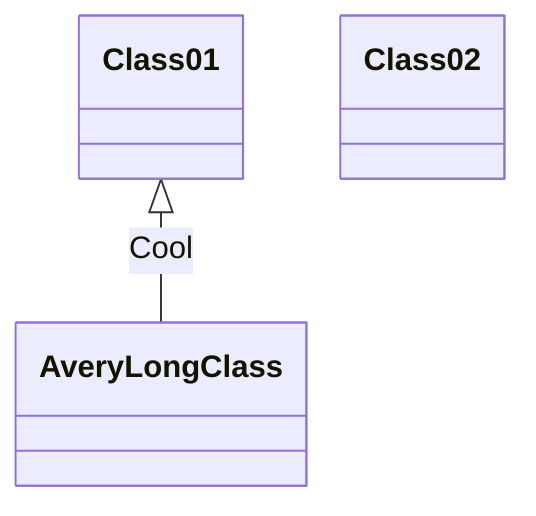

Application Workflow
======

# Define Domain

First, the application should define Domain that application supported, see [[Domain Definition]] for the details.

# UIL

The client send UIL (UAPI Interaction Language) based request to server, the UIL schema should like below:
```
<Domain Operation>(<Operation Arguments>): <Operation Return>
```
The UIL schema is simple, we discuss each part one by one:

## Domain Operation:

This part specify which Domain operation is invoked, it should be like:
```
<Domain Name>.<Operation Name>
```
The operation should be defined in the Domain.

## Operation Arguments:

The arguments of the operation should be contains two sections, one section is filter expression list, the second is assignment expression list, each filter or assignment expression is separated by `,`.

The filter use `:` as separator, like:
```
<Domain Property>:<value>
```

The assigement use `=` as separator, like:
```
<Domain Property>=<value>
```

## Operation Return:

The Operation Return specify which Domain will be returned by this operation, it likes:
```
<Domain Name> {
    <Domain Property List>
}
```

See [[UAPI Interaction Language]] for the details.

# 

Application server receive above request, the `ICommunicationEvent` will be thrown, then the event should be handled by `Communicator`, the `Communicator` will do below things:
* Decode out UQL from `ICommunicationEvent`. -> Using Protocol module
* Get out the root elemet of the UQL and find out the which Domain Operation is invoked.
* Create new `DomainEvent` with topic named `<Domain>.<Operation>` and throw the event.

The `DomainEvent` will invoke corresponding Domain Operation which normally generated at compling time based on Domain object.
The real Domain Operation is a Behavior

