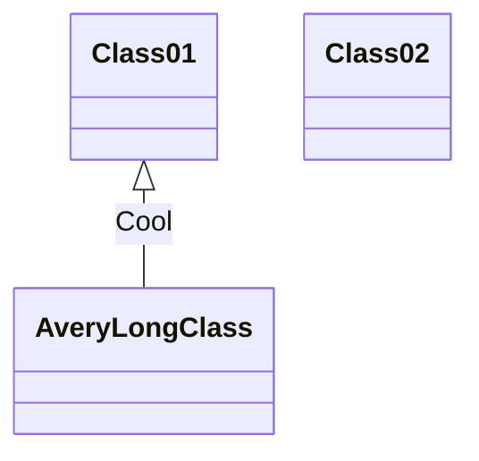

Application Workflow
======

First, the application should define Domain that application supported, see [[Domain Definition]] for the details.

The client send UIL (UAPI Interaction Language) based request to server, the UQL schema should like below:
```
<Domain>.<Operation>(<Arguments>): <Domain> {
    <Domain Field>,
	...
}
```
The first `<Domain>` is a business object, the `<Operation>()` is a Domain operation, the Domain Operation can support put `<Arguments>` to filter the result, the `<Domain>` after `:` is the return type of the Domain Operation, if the return type is a `<Domain>[]` which means the Operation return a Domain list. The statements between `{}` is used to specify the Domain fileds. See [[UAPI Interaction Language]] for the details.

Application server receive above request, the `ICommunicationEvent` will be thrown, then the event should be handled by `Communicator`, the `Communicator` will do below things:
* Decode out UQL from `ICommunicationEvent`. -> Using Protocol module
* Get out the root elemet of the UQL and find out the which Domain Operation is invoked.
* Create new `DomainEvent` with topic named `<Domain>.<Operation>` and throw the event.

The `DomainEvent` will invoke corresponding Domain Operation which normally generated at compling time based on Domain object.
The real Domain Operation is a Behavior

