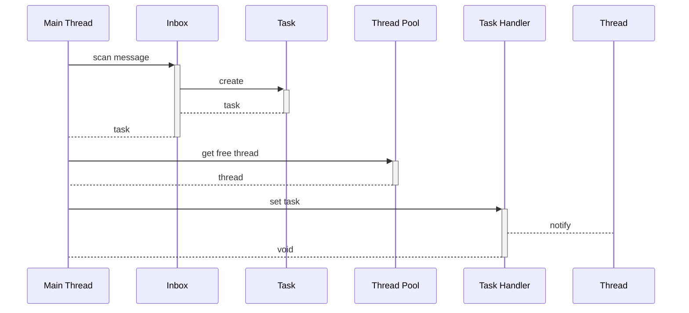

Execution of Behavior
======

# Terminology

* UTM - Unified Thread Management

# Information
| Name | Value |
| ------ | ------ |
| Case No |  1 |

# Introduction
For any application, thread management should be a framework level task, since the thread count should be based on hardware limitation and optimized for task execution.

The UAPI framework provides `Behavior` to describe task content and `Responsible` to execute its `Behavior`, but `Responsible` has no thread to execute `Behavior`, so the `UTM` to provide thread for `Responsible` to execute `Behavior`.

Each `Responsible` own its task list, the task contains `Behavior` which request the corresponding `Responsible` to execute, the `Responsible` has not thread to execute these tasks.

The `UTM` manages a bundle thread - a thread pool, there is a system level thread which has highest priority and is aways runing, the system leve thread scans all task list in the `Responsible` and execute task by `Responsible`'s priority. 

# Workflow
There are two ways to execute `Behavior`:
* Execute directly
* Send message

## Execute Directly
When a `Behavior` needs invoke other `Behavior` to get its result, the invocation is sync, since the `Behavior` is an `Action`, so `Responsible` can specify a `Behavior` when constructing `Behavior`.

* The `Responsible` can publish `Behavior` to common Action Respository, the Behavior will be registered and associate its name by .`Responsible Name::Behavior Name`
* Using `this::Behavior Name` to specify a `Behavior` which is defined in this `Responsible`.
* Using `Responsible Name::Behavior Name` to specify a `Behavior` which is defined in other `Behavior`
* `:` is reseved keywor, `Responsibile` and `Behavior` name is not allowed to contain the keyword. 

## Send Message
When a `Responsible` needs notify some data to other `Responsible`, it will construct a message and send it to one or more `Responsible`, the message will wrapped to a task and put in the `Responsible`'s task list, and then the `UTM` will scan all `Responsible`'s task list, and dispatch thread to execute task by `Responsible`'s priority.

To specify which `Responsible` needs to send message:
* Using `SendMessage` action to send message to one specified `Responsible`, like below:
```java
responsible.newBehavior(...)
	...
	.then(SendMessage.class, "<Responsible Name>", <message data>)
	...
	.build();
```



* Using `Broadcast` action to send message to more `Responsible` which has subscribed the message, like below:
```java
responsible.newBehavior(...)
	...
	.then(Broadcast.class, "<Message Topic>", <message data>)
	...
	.build();
```

# Submodule features

## UTM
### Basic Thread Management
| Name | Value |
| ------ | ------ |
| Feature Id | 1.1 |
| Depends | None |

1. A main thread is always running and is able to manager all thread in the pool.
3. The main thread scans all `Inbox` which has incoming message.
4. The main thread scan `Responsible` list and schedular thread to execute the task which has higher priority.
5. The thread scheduling algorithm should be abstructed to a common interface that can be easy to extend.

## Behavior Framework Features

### Directly Behavior Execution

| Name | Value |
| ------ | ------ |
| Feature Id | 1.2 |
| Depends | [[#Basic Thread Management]] |

1. Verify `Responsible` and `Behavior` name, the reserved keywork - `:` is not allowed.
2. Publish `Behavior` to Action Repository by name `Responsible Name::Behavior Name`.

### Message Sending

| Name | Value |
| ------ | ------ |
| Feature Id | 1.3 |
| Depends | [[#Basic Thread Management]] |

1. `Responsible` has a `Inbox` which is used to store incoming message list, the list should be thread safe, conside non-blocking cycle ring.
2. When new `Responsible` is registered, it will be also registered its `Inbox` to `UTM`.
3. `Inbox` has priority which define the frequence that the `UTM` handle message. 
4. The `Inbox` can wrapp message by `Task` which is corresponding with `Behavior` to execute.

