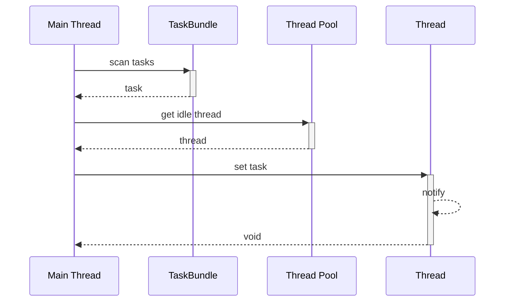
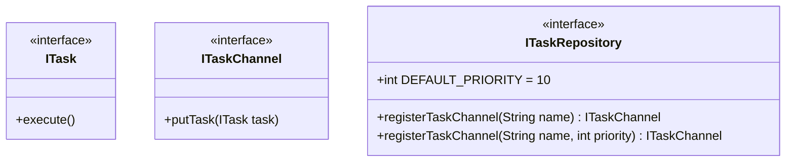

Thread Pool Based Behavior Execution
======

# Terminology

* UTM - Unified Thread Management

# Information
| Name | Value |
| ------ | ------ |
| Case No |  7 |

# Introduction
For any application, thread management should be a framework level task, since the thread count should be based on hardware limitation and optimized for task execution.

The UAPI framework provides `Behavior` to describe task content and `Responsible` to execute its `Behavior`, but `Responsible` has no thread to execute `Behavior`, so the `UTM` to provide thread for `Responsible` to execute `Behavior`.

Each `Responsible` own its task list, the task contains `Behavior` which request the corresponding `Responsible` to execute, the `Responsible` has not thread to execute these tasks.

The `UTM` manages a bundle thread - a thread pool, there is a system level thread which has highest priority and is aways runing, the system leve thread scans all task list in the `Responsible` and execute task by `Responsible`'s priority. 

# Workflow

There are two ways to send mesage to `Inbox`:
* Execute directly (sync way)
* Send message (async way) ^193f80

## Execute Directly
When a `Behavior` needs invoke other `Behavior` to get its result, the invocation is sync, since the `Behavior` is an `Action`, so `Responsible` can specify a `Behavior` when constructing `Behavior`.

* The `Responsible` can publish `Behavior` to common Action Respository, the Behavior will be registered and associate its name by .`Responsible Name::Behavior Name`
* Using `this::Behavior Name` to specify a `Behavior` which is defined in this `Responsible`.
* Using `Responsible Name::Behavior Name` to specify a `Behavior` which is defined in other `Behavior`
* `:` is reseved keywor, `Responsibile` and `Behavior` name is not allowed to contain the keyword. 

## Send Message
When a `Responsible` needs notify some data to other `Responsible`, it will construct a message and send it to one or more `Responsible`, the message will wrapped to a task and put in the `Responsible`'s task list, and then the `UTM` will scan all `Responsible`'s task list, and dispatch thread to execute task by `Responsible`'s priority.

To specify which `Responsible` needs to send message:
* Using `SendMessage` action to send message to one specified `Responsible`, like below:
```java
responsible.newBehavior(...)
	...
	.then(SendMessage.class, "<Responsible Name>", <message data>)
	...
	.build();
```

* Using `Broadcast` action to send message to more `Responsible` which has subscribed the message, like below:
```java
responsible.newBehavior(...)
	...
	.then(Broadcast.class, "<Message Topic>", <message data>)
	...
	.build();
```
The `Broadcast` action will scan all `Responsible` to ask the message is acceptable, the message will be put in the `Responsible`'s `Inbox` if true.

## Handling Message
The main thread has responsiblity to scan message for all `Inbox` and pick up high priority message and consum it, the simple workflow for handling message:


# Submodule features

## UTM
### Basic Thread Management
| Name | Value |
| ------ | ------ |
| Feature Id | 7.1 |
| Depends | None |

1. A main thread is always running and is able to manager all thread in the pool.
2. A task repository to manage all tasks.
3. There is a task channel is used to send new task to task repository.
5. The main thread scans task repository cache to get new task.
6. The thread scheduling algorithm should be abstructed to a common interface that can be easy to extend.

### Exposed APIs



## Behavior Framework Features

### Directly Behavior Execution

| Name | Value |
| ------ | ------ |
| Feature Id | 7.2 |
| Depends | [[Thread Pool  Based Behavior Execution#Basic Thread Management]] |

1. Verify `Responsible` and `Behavior` name, the reserved keywork - `:` is not allowed.
2. Publish `Behavior` to Action Repository by name `Responsible Name::Behavior Name`.

### Message Sending

| Name | Value |
| ------ | ------ |
| Feature Id | 7.3 |
| Depends | [[Thread Pool  Based Behavior Execution#Basic Thread Management]] |

1. When new `Responsible` is registered, it will invoke `ITaskRepository::registerTaskBundle` to create a `TaskBundle` instance with its priority and hold it.
2. When `Responsible` receive a new message, it will wrap the messsage to a task and add the task to `TaskBundle`.
3. 

### Exposed APIs
NONE
