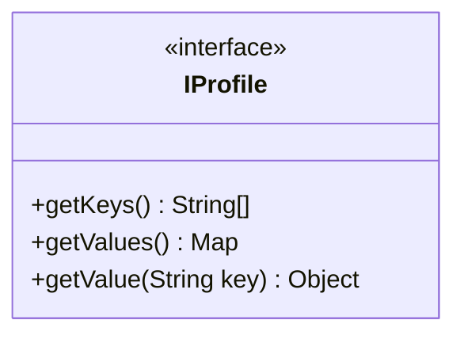

Profiling Framework
==

# Problem

The application is built on many service to provide complex functionality, in some case we are facing some performance issue from differnt position, like reading large file, transfer large content over network will cause performance related issue, so we have to check log to know how the system running.

The profiling framework will provide APIs to make service register itself to the framework, and then the framework can pull service KPIs at specific time period.

# Solution
TBD

