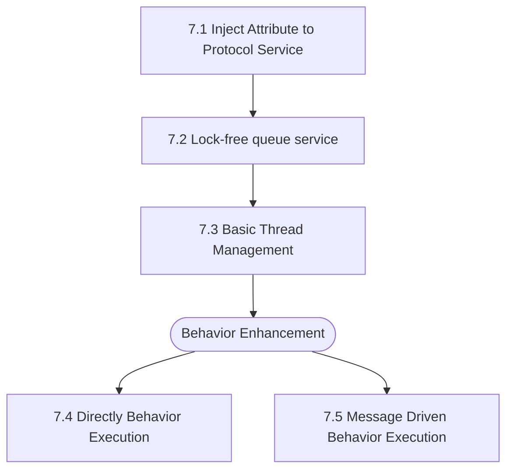

Feature Tracing
===

## Introduction

[[F2.7 Thread Pool Based Behavior Execution HD]]

## Feature Dependency Path

```mermaid
graph TB

A[7.1 Inject Attribute to Protocol Service] --> B[7.2 Lock-free queue service] --> C[7.3 Basic Thread Management] --> D([Behavior Enhancement])
D --> D1[7.4 Directly Behavior Execution]
D --> D2[7.5 Message Driven Behavior Execution]
```