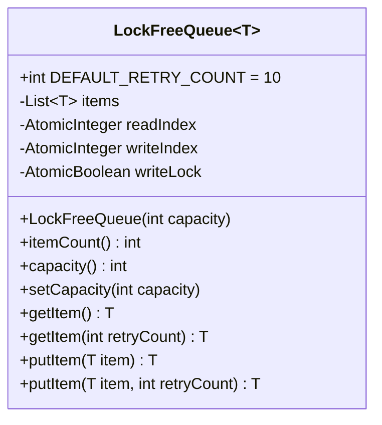

Lock-free Queue
======

# Introduction

Provides a lock-free queue to support [[Thread Pool Based Behavior Execution]]
The lock-free queue is CAS operation based.

# Implementation

## Solution Key Points

* A list to hold all items.
* A read pointer, it point to the list slot which has item can be read.
* A write pointer, it point to the list slot which can be write a new item.
* When read pointer and write pointer point to same slot which means the slot is empty and ready to write, the read pointer can't do read operation.
* Before write a item, it needs to check `write pos + 1 == read pos`, if true the write request can't be done. So the list capacity has one empty slot at least.
* Using "%" operator to make read/write pointer back to start position of the List when the pointer reach to the end of the List.
* The queue has a write lock, so to increase or decrease the queue capacity, the write lock must be set to true, then all write operation must retry until the lock is set to false.
* To increase the capacity, the queue will create new list and move all existing item to new list, and then update write pointer and read pointer.
* To decrease the capacity of the queue, the action should be same as increase capacity, but it needs check that if the existing item count is less than new capacity size, then the decrease operation will fail.

## Class Diagram

