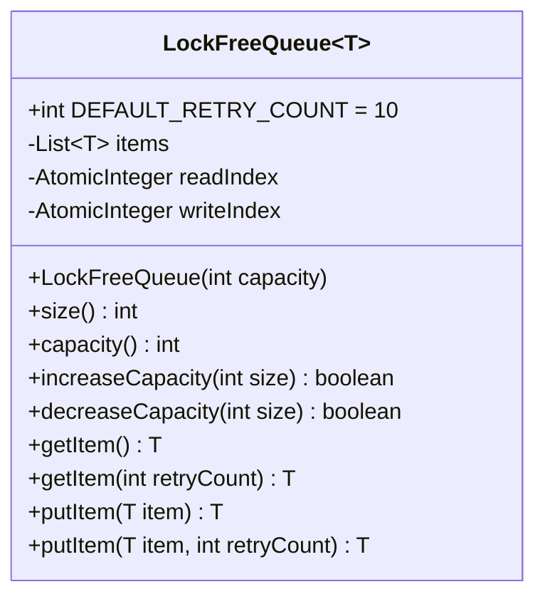

Lock-free Queue
======

# Introduction

Provides a lock-free queue to support [[Thread Pool Based Behavior Execution]]
The lock-free queue is CAS operation based.

# Implementation

## Solution Key Points

1. A List is used to hold all items.
2. Two pointers, one point the slot of the List that has item can be read, the other pointer point the slot of the List that is empty which can be write data.
3. When get a read request, will do:
	1. Get current read and write pointer value
	2. Compare read and write pointer value:
		1. If read pointer value is same as write pointer value, which means no item can be read, the read request return null
		2. If read pointer value is less than write pointer value, will try increase read pointer value by 1:
			1. If success to set read pointer value, will return the value of the List slot that read pointer point to
			2. If fail to set read pointer value which means the read pointer value has been modified by other thead, need go to step 3 to retry
4. When get a write request, will do:
	1. Get current read and write pointer value
	2. Compare read and write pointer value:
		1. If read pointer value is same as write pointer value, which means the queue is empty, then try to do CAS for write pointer value:
			1. If success, will return null to the write request caller.
			2. If fail, needs go to step 4 to retry
		2. If write point value is more then read pointer value, then try increase write point value by 1:
			1. If success to set write pointer value, will set the input item to the List by the write pointer value, and then return null
			2. If fail to set write pointer value, which mean the write pointer value has been set by other thread, needs got to step 4 to retry.
		3. If write point value is less then read pointer value, 
	3. Move 

* Using "%" operator to make read/write pointer back to start position of the List when the pointer reach to the end of the List.

## Class Diagram

