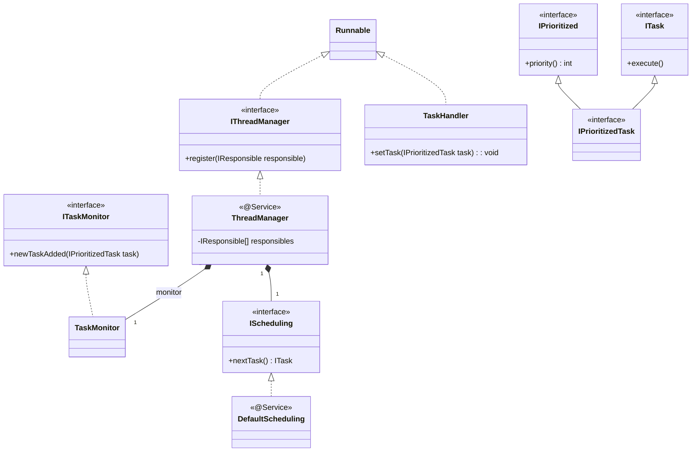
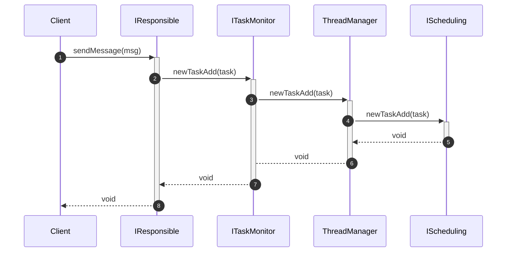
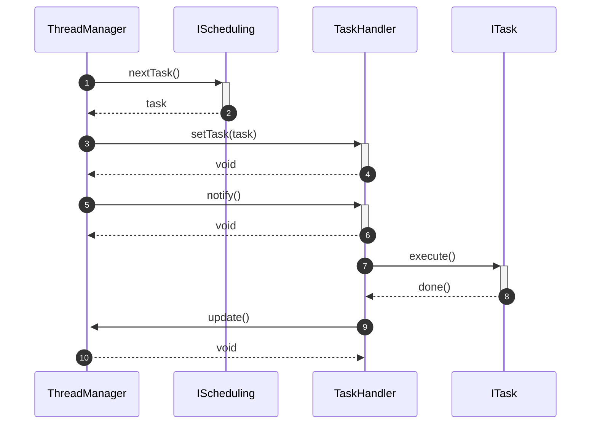

Thread Pool
======

# Introduction
The main target for Thread Pool is provide threads to execte `Behavior` which is defined in `Responsible`, there is a manager thread has resposiblity to scan all `Responsible` and fetch all tasks and dispatch thread to execute `Behavior` which is task associated with it by `Responsible` priority.

# Feature List
## Manager Thread - F2.7.1
1. A manager thread is always running and is able to manager all thread in the pool.
2. A manager thread is able to get notification if new task is added.

## Scheduling Algorithm - F2.7.2
1. An interface for Schduling Algorithm.
2. Default scheduling is priority based.
# Class Diagram

# Key Workflows
## Add New Incoming Task

## Execute Task

## Default Schduling Algorithm