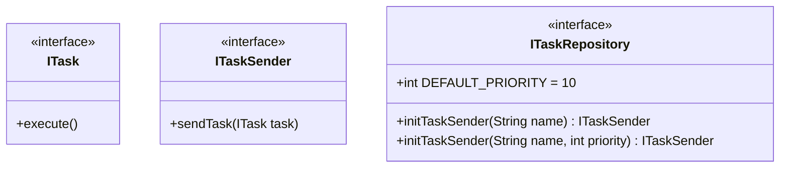
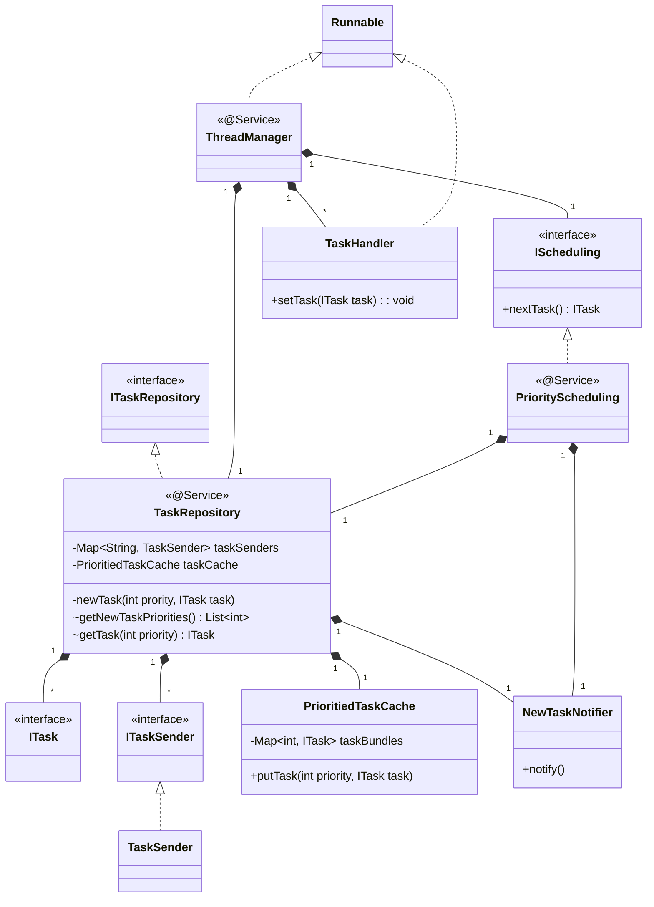
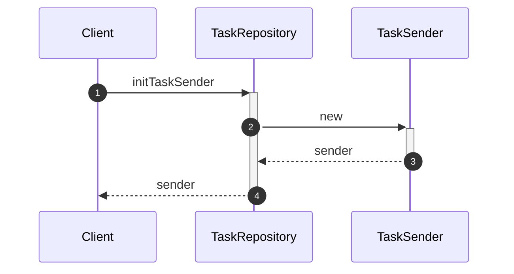
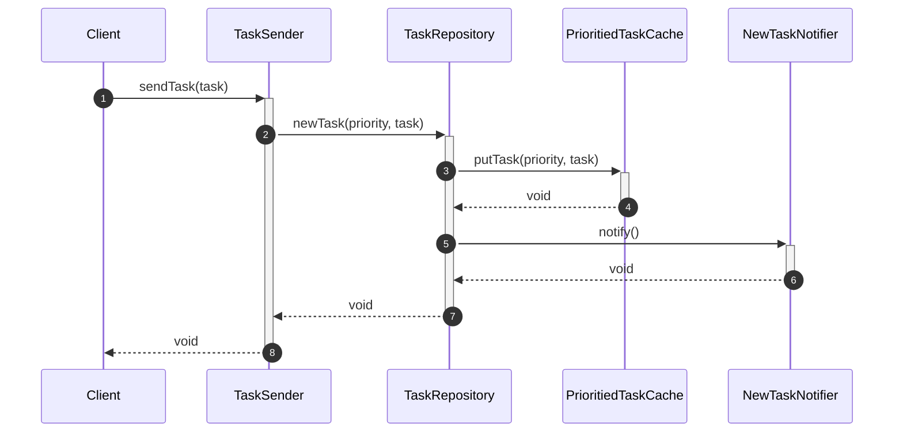
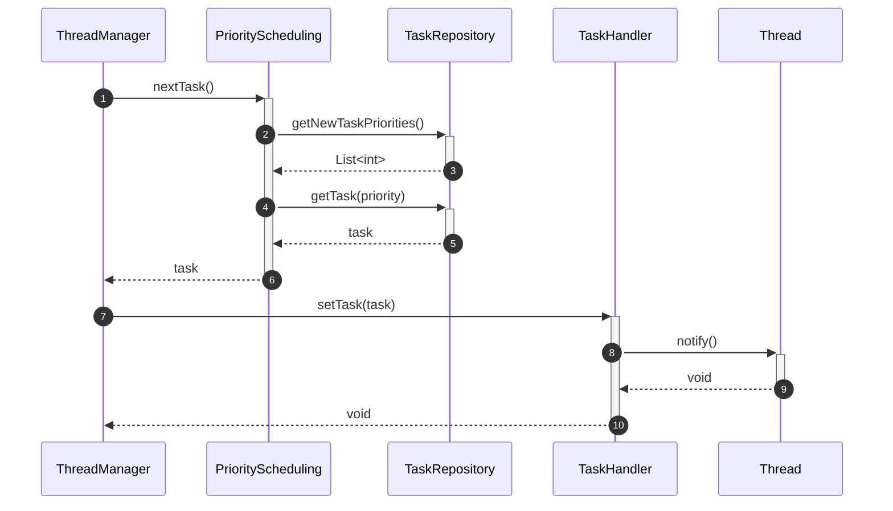

Thread Pool
======

# Introduction
The main target for Thread Pool is provide threads to execte `Task` by priority, there is a manager thread has resposiblity to scan all `Task` in the `Task` repository.

# Feature List
## Manager Thread - F2.7.1
1. A manager thread is always running and is able to manager all thread in the pool.
2. A manager thread is able to get notification if new task is added.

## Scheduling Algorithm - F2.7.2
1. An interface for Schduling Algorithm.
2. Default scheduling is priority based.
# Class Diagram
## Exposed APIs

## Implementation

# Key Workflows
## Register

## Add New Incoming Task

## Execute Task by Priority

## Priority based Scheduling Algorithm
### Pure priority based scheduling
* Same priority task will put in same FIFO queue.
* Scheduling get task first from higher prority queue until the queue goes to empty then get task from lower prority queue.

### Scan time based scheduling
* Same priority task will be put in same FIFO queue.
* All task queue has a value to record its real priority.
* Scheduling will scan All task queue to find out the queue which has most highest real priority and then take task from it.
* The real priorty is dynamic, its calculation is:
	* The real priority value will be decrease (-1) when the scheduling take a task from the queue.
	* The real priority value will be increase (priority * coeficient) when the scheduling does not take any task from the queue.

_BAD_: Scan all task queue and increase/decrease the real priority will consume a lot of time.

### Execution time based scheduling
* Same priority task will be put in same FIFO queue.
* Each task queue has a value to trace the execution time for the task queue.